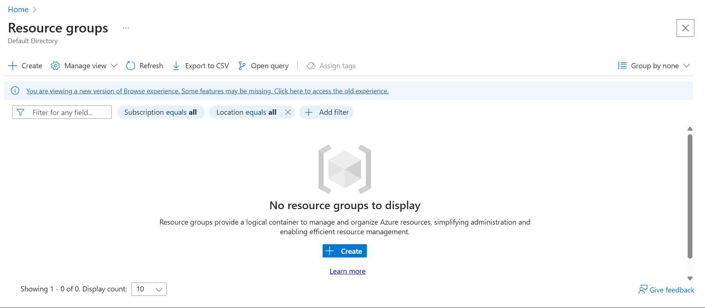

# Cloud-based SOC Lab with Microsoft Azure and Sentinel

## :abc:<mark style="background-color:blue;">Step-1 : Creating Azure Infrastructure</mark>&#x20;

There's free Azure subscribtion which I will use: [https://azure.microsoft.com/en-gb/pricing/purchase-options/azure-account](https://azure.microsoft.com/en-gb/pricing/purchase-options/azure-account)&#x20;

Go through all the necessary steps to sign up, unfortunately it asks you for your credit card to tie it to the account, but as soon as we are within the $200 limit and don't overuse any resourses we are good to go.&#x20;

First, we need to create a <mark style="color:blue;">**resourse group**</mark> where we will add a bunch of another resourses e.g. **virtual machines, virtual network, network security groups**, etc.&#x20;

<figure><figcaption><p><br></p></figcaption></figure>

The **Region** should be the closest to your location. In my case it is UK South. Give it a name as well.&#x20;

<figure><figcaption><p><br></p></figcaption></figure>

When you search for **Resourse Groups** — you will see yours and right now it is completely empty.&#x20;

<figure><figcaption></figcaption></figure>


Next: we need to create a **virtual network** inside our resourse group. The process is pretty straight-forward — <mark style="background-color:green;">you have to choose the same resourse group (obviously) and same region you've chosen before.</mark> You can name your virtual network however you want to, just make sure it is easy to associate it with what we are doing here (which is SOC Lab). \


<figure><figcaption></figcaption></figure>

\
All the security features are disabled by default. :smile: Tap "Create" button and wait a bit.&#x20;

<figure><figcaption></figcaption></figure>

When we go to resourse group to check we will see _**our virtual network there**_ —&#x20;

<figure><figcaption></figcaption></figure>

\
Next, we create a **virtual machine on this network**, this VM will serve as a honeypot :bee::bee: to the peeps who'd love to attack.&#x20;

The name should be quite <mark style="background-color:red;">realistic</mark>, so I named mine **ER-NET-SOUTH-1**.&#x20;

<figure><figcaption></figcaption></figure>

For machine image: **Windows 10 Pro, version 22H2** (you'll need to open the list of available machine images to find this one).

<figure><figcaption></figcaption></figure>

The size: **Standard\_B1s**, it is probably the cheapest one with free services eligible. I hope. \


<figure><figcaption></figcaption></figure>

:computer: Proceed then with **username/password** for your Admin account. Put the ones you will remember. You will need to login to your machine later (several times).&#x20;

Then **OS Disks** — I pretty much followed with the default options. :exclamation:Don't forget to check "**Delete with VM**".&#x20;

<figure><figcaption></figcaption></figure>

In `Network tab` choose your virtual network and don't forget to check "**Delete public IP and NIC when VM is deleted**".&#x20;

<figure><figcaption></figcaption></figure>

In `Monitoring tab` — disable **Boot diagnostics**.\


<figure><figcaption></figcaption></figure>

All the other fields can be just left <mark style="background-color:green;">as it is</mark> by default/any free tier option. \
\
So, in the end I've got this pricing which is pretty affordable. Tap "**Create**". \


<figure><figcaption></figcaption></figure>

In the very end, when you will check your resourse group again you should see this picture with all the available resourses there: **virtual machine, public IP address -ip, network security group -nsg, network interface, disk, and virtual network** we've created before. \


<figure><figcaption></figcaption></figure>

At this stage we finished the basic resourses set up, now it's time to make some mods.&#x20;

***

## :construction\_site: <mark style="background-color:red;">Step-2 : Modifications</mark>&#x20;

Among automatically created resourses you can see **Network Security Group (-nsg)**, we need to modify it and basically "_**open**_" it to the all sorts of mischief (I meant open it to the internet).&#x20;

**Inbound Security Rules** — controls all the traffic that enters the Virtual Network from the Wild West Web. \
\
**Delete** default RDP rules, and instead we should create another inbound rule which will allow <mark style="color:orange;">everything</mark> inbound.&#x20;

<figure><figcaption></figcaption></figure>

\
Go to **Settings** (on the left pane) → Inbound security rules → Add \


<figure><figcaption></figcaption></figure>

The new rule should be set up in the following way: <mark style="color:red;">**we open all ports**</mark> (what we should never do in any other circumstances :joy:) and make our virtual machine vulnerable by purpose.&#x20;

```
Source: Any  
Source port ranges: *  
Destination: Any  
Service: Custom  
Destination port ranges: *  
Protocol: Any  
Action: Allow  
Priority: 100  
Name: DANGER_AllowAnyCustomAnyInbound
```


Let's check it up and login to our VM using RDP:&#x20;

1\) We already have a  public IP address assigned to our VM. Copy it. \
2\) Open Remote Desktop Connection and put there IP address and username/password you gave to this VM previously. \
3\) Connect. \
\
What else we need to do is to <mark style="color:red;">**turn off the firewall**</mark> on this machine. So, we go to Windows Defender Firewall Properties and switched everything to **OFF** state. \


<figure><figcaption></figcaption></figure>

\
Additional check — **ping it**: open PowerShell and `ping VIRTUAL-MACHINE-IP` , to make sure it is accessible.&#x20;


Now let's log off this machine and try to log in with the **wrong credentials** e.g. itadmin, helpdesk, guest, contractor, etc.  :smirk:

<figure><figcaption></figcaption></figure>

Then, if we log in with the **right creds** and will go to <mark style="background-color:green;">**Event Viewer**</mark> on our VM → Windows Logs → Security → Filter for _**4625**_ Event ID you will see "Audit Failure" and there you can see _**all the usernames**_ you've previously tried, your Workstation Name, and even the Source Network Address (which is your own IP address). \


<figure><figcaption></figcaption></figure>

<figure><figcaption></figcaption></figure>

So, it is all okay with logs, logging and visibility. \


***

## :drum: <mark style="background-color:orange;">Step-3 : Microsoft Sentinel</mark>&#x20;

First, we need to create _**Log Analytics Workspace.** Basically it is a container where you collect and analyze your logs and other performance data from different resources. It is  a repo for monitoring, troubleshooting and insights._&#x20;

<figure><figcaption></figcaption></figure>

Don't forget to put it in the same **Resourse group** and give it a proper name.&#x20;

<figure><figcaption></figcaption></figure>


After we set up a Log Analytics Workspace we need to set up <mark style="color:purple;">**Microsoft Sentinel**</mark>. Go to Search and type "sentinel". Tap "**Create**". _It is both SIEM & SOAR solution, that helps you to detect, investigate, respond and hunt across an entire organization's environment._&#x20;

<figure><figcaption></figcaption></figure>

Then we need to **connect** our <mark style="background-color:purple;">Log Analytics Workspace with Sentinel</mark> by adding it, so we could access logs in our SIEM (which Sentinel is). \


<figure><figcaption></figcaption></figure>

Important message to put somewhere down — _free trial time_.&#x20;

<figure><figcaption></figcaption></figure>

Now we have to **create some connection between our virtual machine and Log Analytics Workspace**, so we can have actually those logs. \
\
So, in **Sentinel** (left menu) → Content management → Content hub → Search for Windows Security Events → INSTALL \


<figure><figcaption></figcaption></figure>

After the intallation on the same place where the "INSTALL" button was you will see "MANAGE". Click on it and we'll see _**connector page**_.  Here we want to install "**Windows Security Events via AMA**" by clicking on "Open connector page". \


<figure><figcaption></figcaption></figure>

When on the page we will need to **create** a <mark style="background-color:purple;">data collection rule</mark> by which our **VM forwards logs to our Log Analytics Workspace** which let's us access them via our SIEM (Sentinel).&#x20;

<figure><figcaption></figcaption></figure>

Give it a name and don't forget to put the **same** subscription and Resource group.&#x20;

<figure><figcaption></figcaption></figure>

Here, select the VM you've created for this purpose (I assume someone can have more than one VM)

<figure><figcaption></figcaption></figure>

Everything else I just left to default. Just hit "**Create**" in the end.&#x20;


When you go to your VM page you'll see that you have a new extention (the status of it may vary though).&#x20;

<figure><figcaption></figcaption></figure>

Okay, at this point we've connected everything.&#x20;


***

## :cook: <mark style="background-color:purple;">Step-4 : Log Collection</mark>&#x20;

**Log Analytics Workspace** → Logs (on the left-side panel) → switch from Simple to KQL (Kusto Query Language) mode → type the command "SecurityEvent" → hit RUN.&#x20;

<figure><figcaption></figcaption></figure>

Right now I can't see much of logs here but let's wait for 30-40 mins at least and try the same command again. This will be actuall people trying to log in to your VM. :see\_no\_evil: How cool is that! :sunglasses:\
\
&#xNAN;_**Meanwhile**_: Kusto Query Language Overview: [https://learn.microsoft.com/en-us/kusto/query/?view=microsoft-fabric](https://learn.microsoft.com/en-us/kusto/query/?view=microsoft-fabric)

Since Kusto is a query language  — we can play with different information output e.g.:&#x20;

```kusto
SecurityEvent 
| where Account == "\\ER" 
```

It will show only the records this account has made. OR we can filter events by ID, time, choose what we want to see in output.&#x20;

```kusto
SecurityEvent
| where EventID == 4625
| where TimeGenerated > ago(5m)
| project TimeGenerated, Account, Computer, EventID, Activity, IpAddress
```

Where to learn KQL: [https://kc7cyber.com/modules](https://kc7cyber.com/modules)&#x20;


:tada:Logs started to appear:&#x20;

<figure><figcaption></figcaption></figure>

At this point I just take time to go through different properties this logs have. _**Out of curiosity**_. \


***

## :map: <mark style="background-color:blue;">Step-5 : Mapping IP addresses to geolocation</mark>&#x20;

What we need is to create a **watchlist** in **Sentinel** and then we can create a map.&#x20;

**Sentinel** → Log Analytics Workspace → Configuration → Watchlist → Create 'NEW' one. The name and alias of the watchlist is simply “**`geoip`**”.

<figure><figcaption></figcaption></figure>


_For Source: browse for a file you've download on your machine_. \
\
The link is provided on the youtube page of the video I've used for this lab, kindly provided by @Josh Madakor:  hxxps\[://]youtu\[.]be/g5JL2RIbThM

<figure><figcaption></figcaption></figure>

You should get a table like this after downloading the `geoip-summarized.csv` file.&#x20;

<figure><figcaption></figcaption></figure>

For the SearchKey choose: `network`

<figure><figcaption></figcaption></figure>

Overall it should be like _**55K**_ of Watchlist items. Status: Succeeded. It takes some time to download though.

<figure><figcaption></figcaption></figure>

As soon as uploading is complete we can use this query to run with _**any attacker IP address**_.&#x20;

```kusto
let GeoIPDB_FULL = _GetWatchlist("geoip");
let WindowsEvents = SecurityEvent
    | where IpAddress == <attacker IP address>
    | where EventID == 4625
    | order by TimeGenerated desc
    | evaluate ipv4_lookup(GeoIPDB_FULL, IpAddress, network);
WindowsEvents
```

<figure><figcaption></figcaption></figure>

As you can see, it shows <mark style="background-color:green;">**geolocation data**</mark> now as well: _**country, city, latitude and longitude**_.&#x20;

You can add the following to highlight **specifically those fields** —&#x20;


```kusto
| project TimeGenerated, Computer, AttackerIp = IpAddress, cityname, countryname, latitude, longitude
```



<mark style="background-color:orange;">To visualize it all on the map we have to create a workbook in Sentinel.</mark>&#x20;

**Sentinel** → Log Analytics workspace → Threat Management → Workbooks → Add Workbook.&#x20;

<figure><figcaption></figcaption></figure>

Go to `Edit` and remove pre-populated info (both messages).

<figure><figcaption></figcaption></figure>

After removing it: click `Add` → `Add query` and go to **Advanced Editor (delete the default info)** and put this `JSON` there and hit save. \


<figure><figcaption></figcaption></figure>

```json
{
	"type": 3,
	"content": {
	"version": "KqlItem/1.0",
	"query": "let GeoIPDB_FULL = _GetWatchlist(\"geoip\");\nlet WindowsEvents = SecurityEvent;\nWindowsEvents | where EventID == 4625\n| order by TimeGenerated desc\n| evaluate ipv4_lookup(GeoIPDB_FULL, IpAddress, network)\n| summarize FailureCount = count() by IpAddress, latitude, longitude, cityname, countryname\n| project FailureCount, AttackerIp = IpAddress, latitude, longitude, city = cityname, country = countryname,\nfriendly_location = strcat(cityname, \" (\", countryname, \")\");",
	"size": 3,
	"timeContext": {
		"durationMs": 2592000000
	},
	"queryType": 0,
	"resourceType": "microsoft.operationalinsights/workspaces",
	"visualization": "map",
	"mapSettings": {
		"locInfo": "LatLong",
		"locInfoColumn": "countryname",
		"latitude": "latitude",
		"longitude": "longitude",
		"sizeSettings": "FailureCount",
		"sizeAggregation": "Sum",
		"opacity": 0.8,
		"labelSettings": "friendly_location",
		"legendMetric": "FailureCount",
		"legendAggregation": "Sum",
		"itemColorSettings": {
		"nodeColorField": "FailureCount",
		"colorAggregation": "Sum",
		"type": "heatmap",
		"heatmapPalette": "greenRed"
		}
	}
	},
	"name": "query - 0"
}
```

<figure><figcaption></figcaption></figure>

Then hit "**Save**", change the name of the map ( + assign it to our resource group and location).&#x20;

That's pretty much it! :cookie:

This screenshot has been taken _**around 2.5 hours**_ since we started to gather the logs and exposed our Virtual Machine to the Wild West Web. :smirk\_cat:\


<figure><figcaption></figcaption></figure>

\
This screenshot has been taken in less than 24 hours — :joy:

<figure><figcaption></figcaption></figure>

To be continued... :imp:


P.S. Just the mere number of attempts is very impressive!&#x20;

<figure><figcaption></figcaption></figure>
